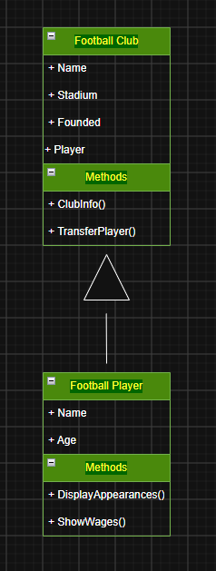
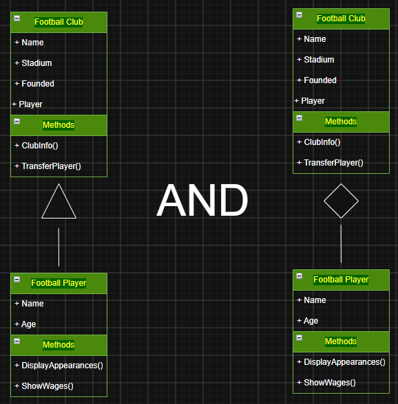
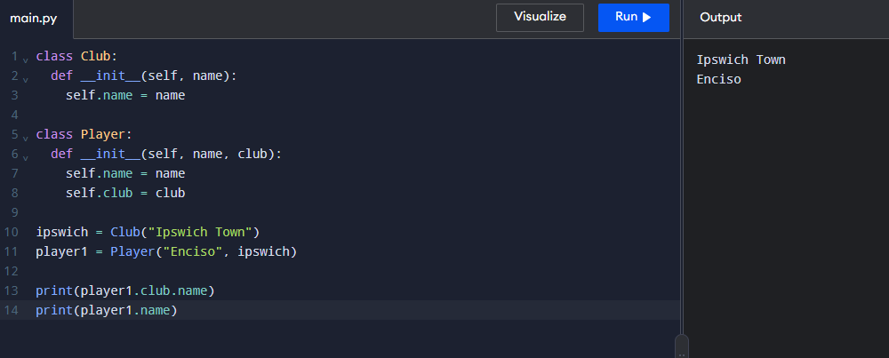
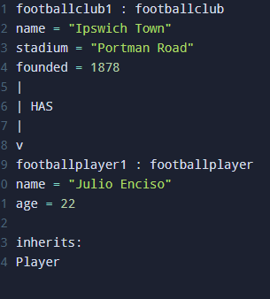

# Advanced Class Relationships
## Previous Activities
[classAttrib](classAttributesMethods.md)
[classRel](classRelationships.md)

## Existing System Description:
## Inheritance Relationship
Parent: Football Club
Child: Football Player
Explanation: A football player plays for a football club. The information of a football player can be traced back to the football club. 

## Inheritance UML

## Composition/Aggregation
Relationship: Weak HAS-A relationship
Explanation: A football player can exist without a football club; they are called 'free agents'. 'Free Agents' are player without a club and can be signed by a club without a transfer fee.

## Advanced UML Diagram

## Python Implementation
[Source Code](advancedRelationships.py)

## Test Run

## Object Diagram

## Reflection
1. Why did you choose your inheritance relationship? Explain why your child class is a type of your
parent class.
2. How did inheritance reduce duplicate code? Identify attributes or methods that were reused.
3. Why is your HAS-A relationship Composition or Aggregation? Explain the lifecycle relationship
between the two objects.
4. What is the difference between Association from Part III and the advanced relationship you
implemented?
5. How does your design follow the DRY principle?

### Answers:
1. I chose this inheritance relationship because of it's application in the real world. A football player can exist without a club, and a club can exist without a player. The child is a type of parent class because they both contain information from the sport and are similar.
2. The reduced code
