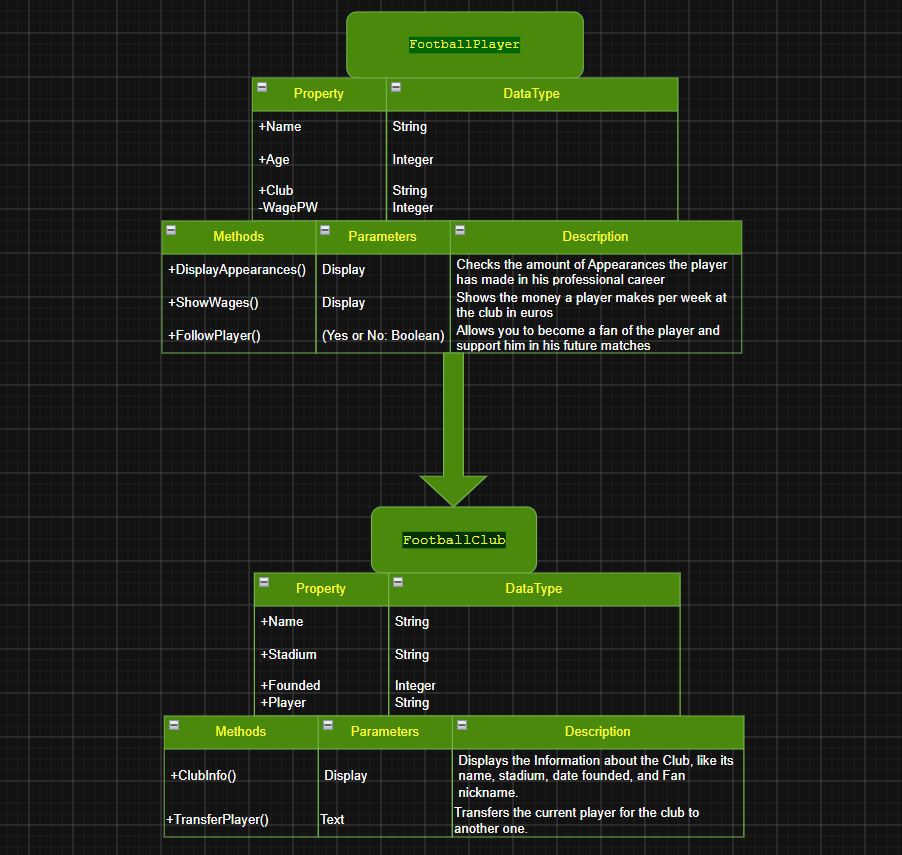
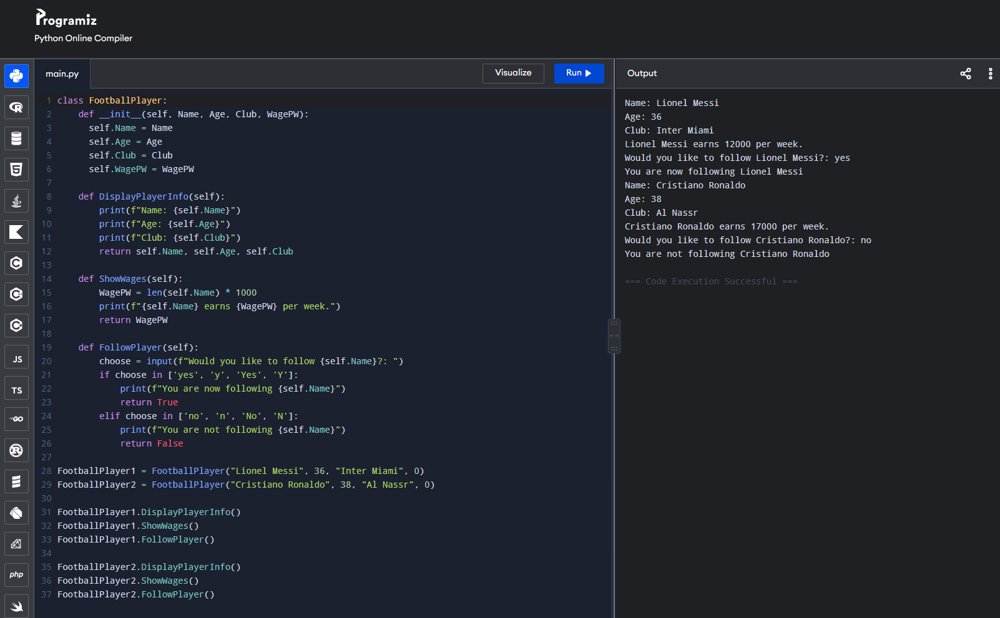
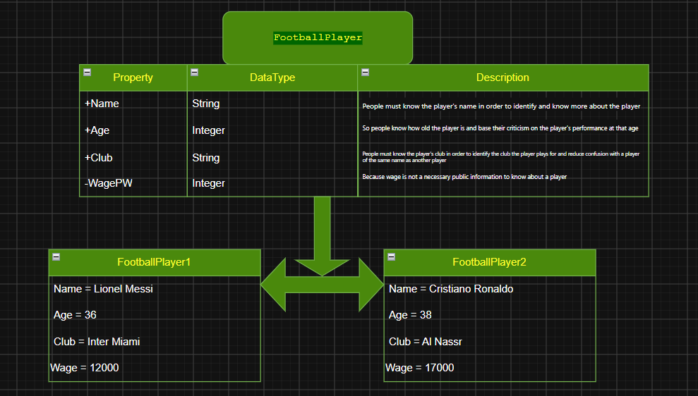

# Class Attributes and Methods

## Previous Design

Link to my previous activity:
[classobjectUML.md](classobjectUML.md)

## Design Revision
Describe any changes made to your original class.
## Visibility Decisions
| Attribute | Data Type | Visibility | Reason |
|---|---|---|---|
| Name | string | + | People must know the player's name in order to identify and know more about the player |
| Age | integer | + | So people know how old the player is and base their criticism on the player's performance at that age |
| Club | string | + | People must know the player's club in order to identify the club the player plays for and reduce confusion with a player of the same name as another player |
| WagePW | integer | - | Because wage is not a necessary public information to know about a player  |

## Updated UML Class Diagram

## Python Implementation
[View Python Source](classImplementation.py)

## Test Run

## Object Diagram

## Analysis
### Why did you make your chosen attribute private?
#### Because the wages of a player is not not necessary, and only the public information is good enough to present to the user.

### Which method changes the state of your object?
#### The "FollowPlayer" function, it changes the state of the object to True or False, and "CheckWages" function, where the original wage is zero, but later changes depending on the length of the player's name times one thousand.

### How did your two objects demonstrate that instances are independent?
#### Both objects were not affected by the collateral if both objects were dependent, and both objects also had different values from each other, hence showing independence.

### What is the difference between your class diagram and your object diagram?
####My class diagram shows the objects and methods of the class, without any changing or final variables. My object diagram on the other hand, shows the created objects and their FINAL value variable.
