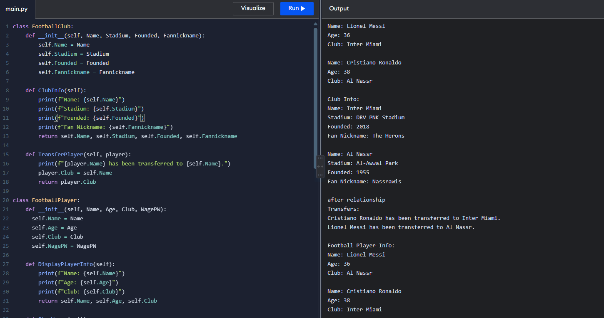
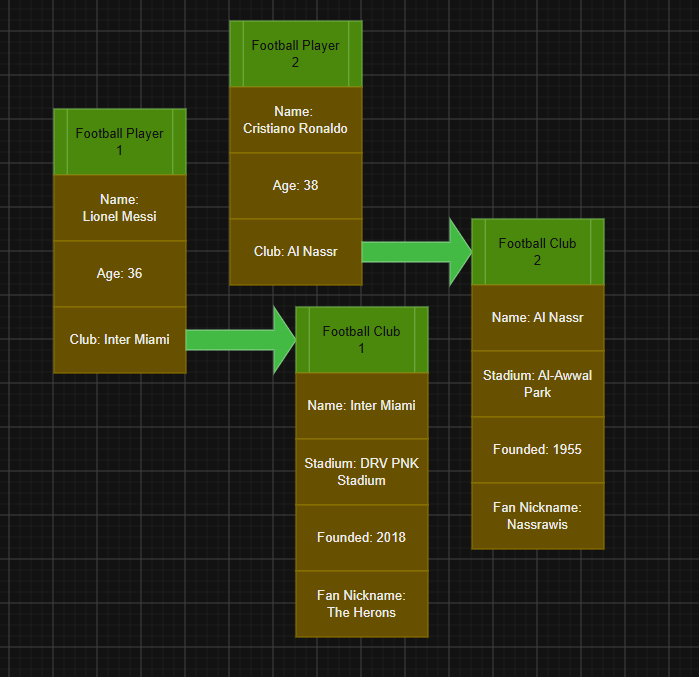

# Class Relationships: Association and Multiplicity

## Previous Work

[Part I - Classes and Objects](classObjectUML.md)
[Part II - Class Attributes and Methods](classAttributesMethods.md)

## Existing Class
Class:
### FootballPlayer
Description:
### The basic information about a Football Player

## New Related Class
Class:
### FootballClub
Description:
### The club a player plays for

## Association
Relationship:
### Plays for
Explanation:
### An athlete plays for a team, group, or a team. A football player plays for a club.

## Multiplicity
Multiplicity:
### 1:1 Multiplicity
Explanation:
### Every Player only plays for one club during their stay and can't play for multiple clubs at once.

## UML Class Relationship Diagram

## Python Implementation
[View Python Source](classRelationships.py)

## Test Run

## Object Relationship Diagram

## Analysis
### What is the association between your two classes?
A football player plays for a club that they represent. The football player contains the information about the club, while the club contains the player. The two classes complement each other very well, which is what their association is.
### What multiplicity did you choose and why?
A 1:1 multiplicity because a football player can only play for one club at a time. If the multiplicity changes to another, it might break the rule where a player can only play for one club. It can also cause many problems when the player transfer to another club when he already plays for multiple clubs.
### How did you implement the relationship in Python?
I implemented the relationship through displaying the player's info and club's info. The player displays the name of the club and the club displays the name of the player. Both classes are involved when a player wants to transfer to another club.
### Why did you store an object reference instead of copying its data?
Storing an object reference helps with variety in the code and data. Simply copying the data can often times cause confusion and make the objects repetitive. Having an object can help with quality of life as well as coding in Python.
### If your relationship uses many, why is a list appropriate?
My relationship does not use many because it is a one-to-one relationship.
